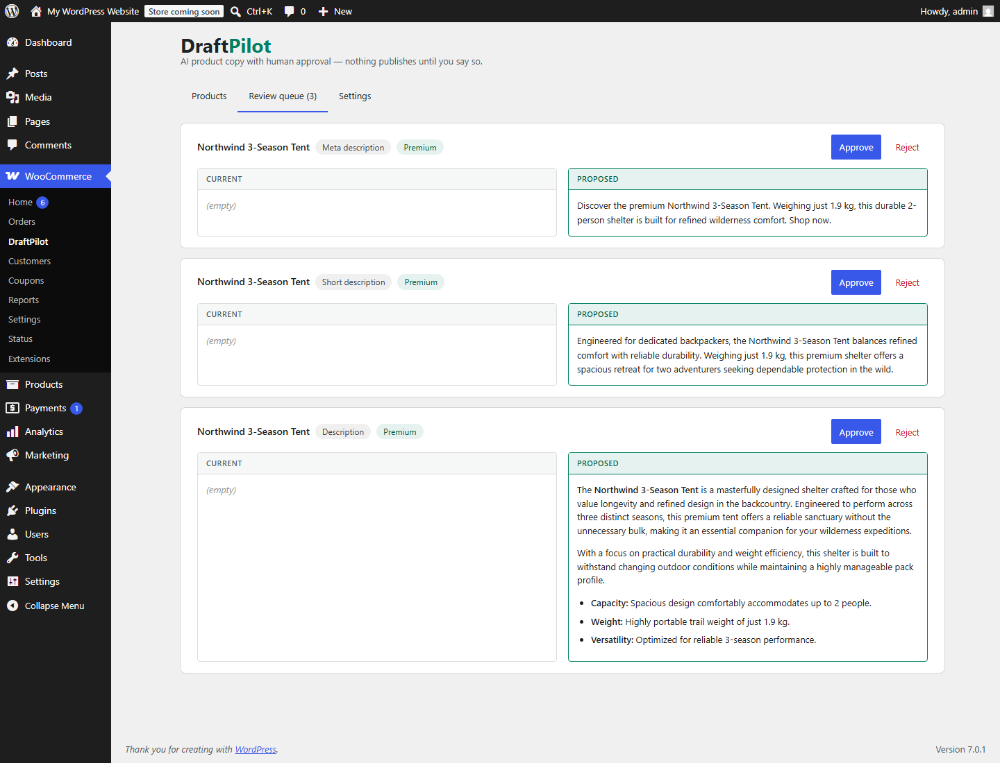
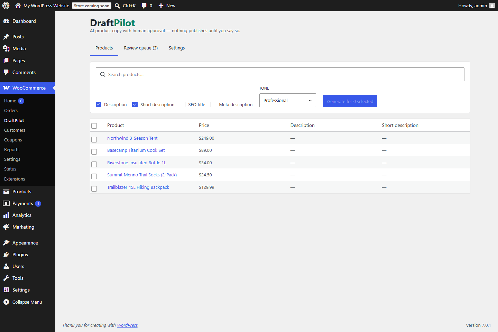

# Copyquill for WooCommerce

An AI product copywriter for WooCommerce with a **human-in-the-loop review queue**: Google Gemini drafts product descriptions, short descriptions, and SEO meta from your real product data — and nothing touches the live store until a human clicks **Approve**.

Built as a full-stack portfolio project by [Perfecto II Cayabyab](https://perfectocayabyab.com/), alongside [ShopPilot](https://github.com/PerfectoCayabyab/shoppilot) (the same approval-gated AI pattern as a Shopify app) and [Storefront Copilot](https://github.com/PerfectoCayabyab/storefront-copilot).



## What makes this interesting

- **Review before publish.** Every generated draft lands in a review queue with a side-by-side *current vs proposed* comparison. Approve applies it; reject discards it; a newer draft supersedes the old one. Deciding a draft twice is rejected with a 409.
- **Grounded generation.** Prompts are built from the product's live data — name, price, categories, tags, attributes, SKU, existing copy — and Gemini is forced through a JSON response schema, so output is structured, not scraped from prose. The model is explicitly instructed never to invent specs.
- **Real WordPress plugin architecture.** Custom REST namespace (`copyquill/v1`) with `manage_woocommerce` permission checks, a custom drafts table via `dbDelta`, a React admin app built on `@wordpress/components` + `@wordpress/scripts`, settings sanitization, i18n, and full uninstall cleanup.
- **SEO plugin integration.** Approved SEO titles and meta descriptions are written to Yoast SEO or Rank Math fields automatically when either is active.
- **wordpress.org-ready.** GPL-2.0+, `readme.txt` with the required external-services disclosure, no CDN assets, `npm run plugin-zip` produces the installable/submittable ZIP.



## What it generates

| Field | Constraints |
| --- | --- |
| Description | 2–4 paragraphs of clean HTML (`p`, `ul`, `li`, `strong` only), 120–220 words |
| Short description | One punchy plain-text paragraph, 25–45 words |
| SEO title | ≤ 60 characters |
| Meta description | 120–155 characters with a subtle call to action |

Tone presets (professional / friendly / premium / playful / minimal), free-text brand voice notes, and output language are configurable. Bulk generation runs across selected products with live progress.

## The approval flow

```
Select products → Generate (Gemini, JSON schema)
        │
        ▼
Pending drafts in the custom table
        │
        ▼
Review queue: current vs proposed, side by side
        │
        ├─ Approve → wp_kses-sanitized copy applied to the product
        │            (+ Yoast / Rank Math meta if active)
        └─ Reject  → nothing changes
```

## Stack

PHP 7.4+ · WordPress REST API · WooCommerce CRUD (`WC_Product`) · React (`@wordpress/element`, `@wordpress/components`) · `@wordpress/scripts` build · Google Gemini structured output · custom `$wpdb` table

## Development

Requirements: Node 20+. No local PHP or Docker needed — development runs on [WordPress Playground](https://wordpress.org/playground/):

```bash
npm install
npm run build

# put your free Gemini API key (aistudio.google.com/apikey) in dev/.gemini-key, then:
npx @wp-playground/cli server --blueprint=dev/blueprint.json \
  "--mount=.:/wordpress/wp-content/plugins/copyquill-for-woocommerce" --port=9400 --login
```

The blueprint installs WooCommerce, activates the plugin, seeds five demo products, and opens **WooCommerce → Copyquill**.

```bash
npm run plugin-zip   # builds the distributable ZIP for wp-admin upload / wordpress.org
```

## License

GPL-2.0-or-later.
